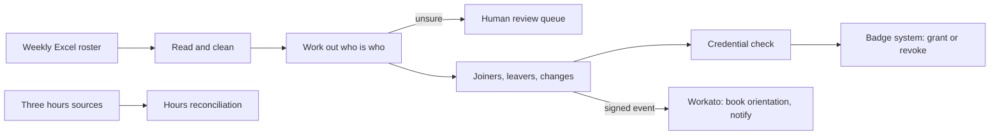
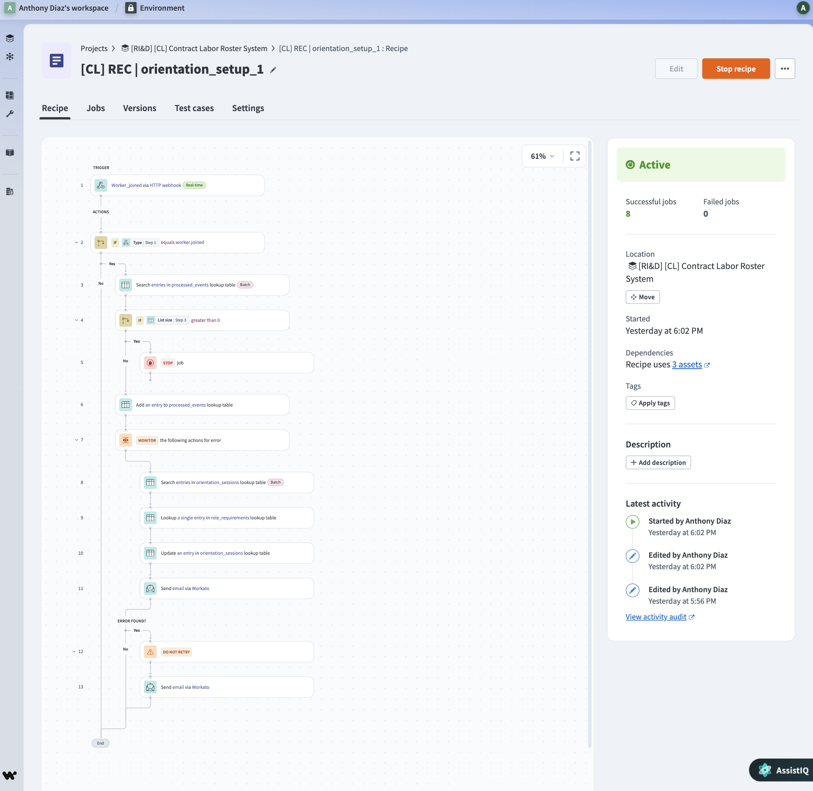

# Contract Labor Roster Sync

Onboarding, credential checks, site-access badging and hours reconciliation
for about eighty agency workers whose only system of record was a weekly
spreadsheet.

Python · SQLite · REST with OAuth 2.0 · signed webhooks · Workato · 201 tests

## The situation

On an installation program inside a live fulfillment center, a staffing
agency supplied roughly eighty material handlers and production workers. Once
a week the agency emailed an Excel file with five columns: first name, last
name, phone, email, role.

Everything ran off that file, by hand. Each worker needed a safety
orientation, protective equipment, a site badge and, for forklift and hoist
roles, a verified certificate. People joined and left every week. They had
no company email, so communication was by phone. Hours came from a
badge-scanner laptop and were checked against agency invoices in another
spreadsheet.

## Why I built this

To make this process easier for the business that has to run it. Done by
hand, a weekly roster costs a coordinator hours of comparing lines by eye,
and the mistakes are expensive ones: a badge that stays active after someone
has left, a new hire who arrives and cannot start, a certificate nobody
checked, an invoice that cannot be verified line by line.

The goal here is that the weekly file becomes a routine: drop it in, get a
short list of the few questions only a person can answer, and let everything
else happen the same way every time. It is safe to run twice, it never
guesses when guessing could put the wrong person on site, and it says
plainly what it could not work out.

## The one hard problem

**The spreadsheet has no ID column.** Nothing in this week's file says
whether a line is the same person as a line in last week's file. Names get
misspelled, phones change, relatives share a phone, numbers get recycled.

Everything else depends on getting that right. Match too eagerly and two
people share one badge. Match too cautiously and the same person is
onboarded twice, or a departed worker's badge stays live. Any integration
fed by a file instead of an API has this problem.

## What it does



- **Python owns the records**: reading bad spreadsheets, identity,
  credentials, badge access, hours.
- **Workato owns the people side**: booking orientation seats against
  capacity and notifying workers. Retries and reminders are solved problems
  in an integration platform, so they are not hand-built here.



## What it demonstrates

- **Identity without a key.** Phone or email matches merge automatically only
  when the name is compatible; anything doubtful goes to a person, and that
  person's decision fixes the data so the question is not asked twice.
- **Safe to rerun.** Running the same file twice changes nothing: no
  duplicate workers, no repeated API calls, the same event ids.
- **Fails in the safe direction.** An unanswered question never deactivates
  a badge. An unreadable role blocks access instead of guessing.
- **Real integration plumbing.** OAuth 2.0 client credentials, retries with
  backoff, idempotency keys, HMAC-signed webhooks, and a receiver that
  discards duplicate deliveries.
- **Reviewed hard.** A critical review found 59 issues, including four that
  contradicted this README. Each behavior fix has a test that fails without
  it.

## The design decisions, one line each

1. Worker ids are issued, never derived from a name or phone.
2. Phone or email merges automatically only when the name is compatible.
3. Conflicting signals go to a person; no rule silently picks a winner.
4. Absence is worked out from the files processed, not counted per run.
5. An unanswered review question never deactivates anyone.
6. A review decision changes the data, so the same row matches next week.
7. The credential gate blocks when it is unsure.
8. Credential records are only ever added, never overwritten.
9. Badge changes compare stored state: an unchanged week makes zero calls.
10. Event ids are deterministic, so a resend is recognized as a repeat.

The reasoning, the alternatives rejected and the known limits of each are in
**[docs/design.md](docs/design.md)**, with the event contract, a full sample
run and the Workato recipe in detail.

## Run it

```bash
pip install -r requirements.txt        # Python 3.9 or newer
python -m pytest tests/ -q            # 201 tests
python samples/run_pipeline.py        # the whole flow on sample files
```

The demo reads two messy sample rosters, resolves identities, checks
credentials, grants badges, reruns to show zero API calls, reconciles a pay
period and emits signed events.

## Honest limits

- A relative on a shared phone with no identifier of their own cannot be
  onboarded until the agency supplies one.
- A near-identical name on a known phone (`Mario` for `Maria`) is treated as
  a typo unless both appear in the same file.
- The Workato recipe does not yet verify the webhook signature, and email
  stands in for SMS.
- Reminders, escalation and the supervisor digest are not built.
- The badge system and the hours sources are simulated; no real site data is
  in this repository.

## Layout

```
roster_sync/   the package: ingest, identity, diff, review, store,
               credentials, provisioning, hours, events
config/        role names and the credentials each role requires
samples/       sample files, the end-to-end demo, a signed test-event sender
docs/          design notes and Workato screenshots
tests/         201 tests
```

MIT licensed.
